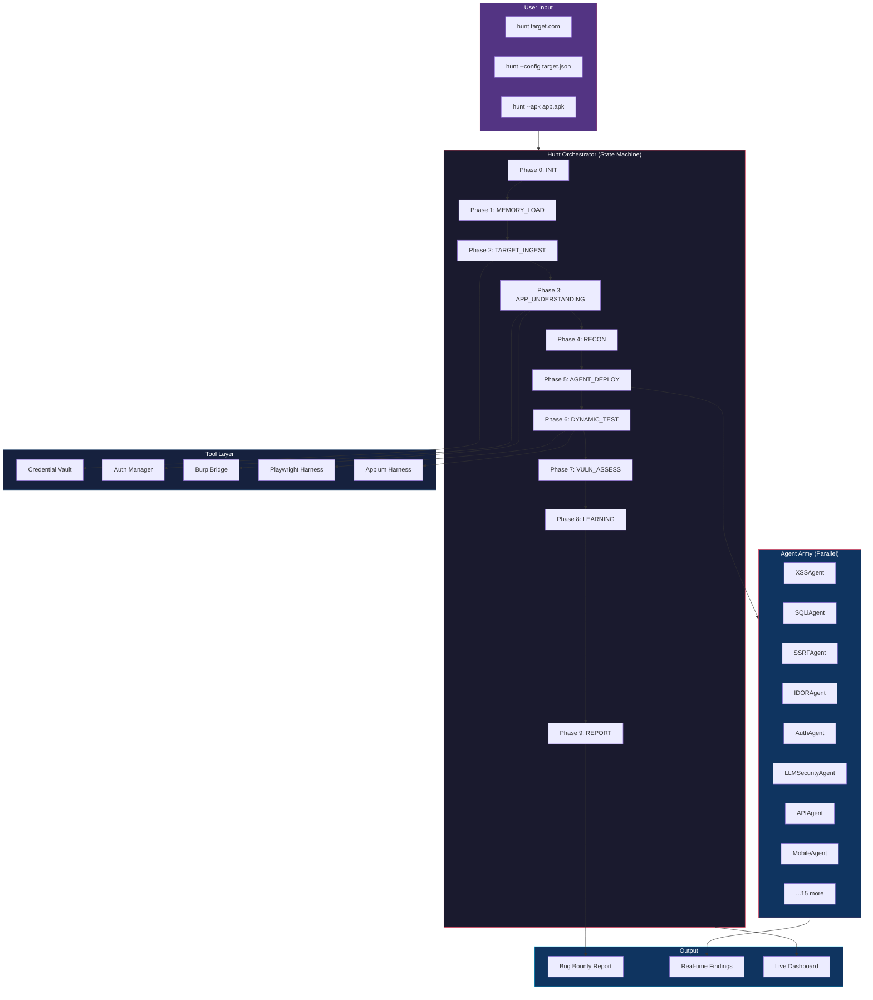

<p align="center">
  
</p>

<h1 align="center">BugHunter AI</h1>

<p align="center">
  <strong>Autonomous Bug Bounty Hunting Framework Powered by Claude Code</strong>
</p>

<p align="center">
  <em>20 specialized AI agents. State-machine orchestration. Zero human input required.</em>
</p>

<p align="center">
  <a href="#quick-start">Quick Start</a> &bull;
  <a href="#features">Features</a> &bull;
  <a href="#architecture">Architecture</a> &bull;
  <a href="#installation">Installation</a> &bull;
  <a href="#sample-prompts">Sample Prompts</a> &bull;
  <a href="#agents">Agents</a> &bull;
  <a href="#contributing">Contributing</a>
</p>

<p align="center">
  
  
  
  
  
</p>

---

## What is BugHunter AI?

BugHunter AI is an **autonomous bug bounty hunting framework** that turns [Claude Code](https://docs.anthropic.com/en/docs/claude-code) into an elite security researcher. Type `hunt <target>` and watch 20 specialized AI agents systematically map, analyze, and attack your target — finding critical vulnerabilities that manual testing misses.

```bash
# That's it. One command. Autonomous hunting.
hunt https://app.example.com
```

**What happens next:**
1. A state machine initializes and tracks 10 phases of the hunt
2. Credentials are loaded from an encrypted vault (never inline)
3. The app is profiled — flows mapped, tech stack fingerprinted, trust boundaries identified
4. Hypothesis-driven agents deploy in parallel — each with a specific attack theory
5. Findings are reported in real-time with CVSS scoring
6. A professional bug bounty report is generated automatically

---

## Why BugHunter AI?

| Manual Bug Bounty | BugHunter AI |
|---|---|
| Hours of recon before first payload | Autonomous recon → profiling → attack in minutes |
| Forget where you left off between sessions | State machine checkpoints every phase — `--resume` anytime |
| Credentials in plaintext notes | Encrypted vault with 1Password integration |
| Run same tools blindly on every target | Hypothesis-driven: agents attack WHERE the AppProfile says bugs live |
| Test one thing at a time | 5 agents run in parallel, findings shared in real-time |
| Miss AI/LLM vulnerabilities | Dedicated LLMSecurityAgent with OWASP LLM Top 10 |
| Medium findings silently dropped | Mediums archived for attack chain correlation |
| No memory between hunts | Cross-session learning — gets smarter with every engagement |

---

## Features

### Core Framework
- **State Machine Orchestration** — 10-phase hunt lifecycle with checkpointing, retry-on-fail, and resume support
- **Credential Vault** — Encrypted credential storage, environment variable overrides, 1Password CLI integration, auto-redaction
- **Auth Flow Automation** — B2C, OAuth, SAML, SSO strategies with session persistence and auto-refresh
- **Live Dashboard** — Real-time phase progress, finding counts, and agent status via `--status`

### Intelligence
- **20 Specialized Agents** — Each agent is an expert in one vulnerability class (XSS, SQLi, SSRF, IDOR, etc.)
- **Hypothesis-Driven Testing** — Agents receive specific attack hypotheses from AppProfile, not "scan everything"
- **AI/LLM Target Track** — Dedicated LLMSecurityAgent for OWASP LLM Top 10, prompt injection, RAG poisoning
- **Cross-Session Learning** — Findings and techniques persist across hunts, pattern matching improves over time

### Integration
- **Burp Suite MCP Bridge** — Health checks, scope sync, traffic verification, Collaborator polling, HAR export
- **Playwright Dynamic Testing** — Browser automation for DOM-based testing, app profiling, and evidence capture
- **Appium Mobile Testing** — Android/iOS app security testing with SSL pinning bypass
- **Configurable Severity** — Three modes: `bounty` (CVSS>=8.0), `pentest` (>=4.0), `comprehensive` (all)

---

## Architecture



---

## Quick Start

### 1. Prerequisites

You need these installed before using BugHunter AI:

| Tool | Required | Install | Purpose |
|------|----------|---------|---------|
| **Claude Code** | Yes | `npm install -g @anthropic-ai/claude-code` | The AI engine |
| **Bun** | Yes | `curl -fsSL https://bun.sh/install \| bash` | TypeScript runtime for tools |
| **Playwright** | Yes | `bun add playwright && bunx playwright install chromium` | Browser automation |
| **Burp Suite** | Recommended | [portswigger.net](https://portswigger.net/burp) | Proxy & traffic analysis |
| **Go tools** | Recommended | See below | Recon toolchain |

<details>
<summary><strong>Install Go recon tools (click to expand)</strong></summary>

```bash
# Install Go first: https://go.dev/dl/
go install github.com/projectdiscovery/subfinder/v2/cmd/subfinder@latest
go install github.com/projectdiscovery/httpx/cmd/httpx@latest
go install github.com/projectdiscovery/nuclei/v3/cmd/nuclei@latest
go install github.com/projectdiscovery/naabu/v2/cmd/naabu@latest
go install github.com/tomnomnom/assetfinder@latest
go install github.com/tomnomnom/waybackurls@latest
go install github.com/tomnomnom/unfurl@latest
go install github.com/lc/gau/v2/cmd/gau@latest
go install github.com/ffuf/ffuf/v2@latest
go install github.com/sensepost/gowitness@latest
```

</details>

<details>
<summary><strong>Optional: 1Password CLI for credential vault</strong></summary>

```bash
# macOS
brew install 1password-cli

# Linux
curl -sS https://downloads.1password.com/linux/keys/1password.asc | \
  sudo gpg --dearmor --output /usr/share/keyrings/1password-archive-keyring.gpg
# Then follow: https://developer.1password.com/docs/cli/get-started/
```

</details>

<details>
<summary><strong>Optional: sqlmap for SQL injection testing</strong></summary>

```bash
# macOS
brew install sqlmap

# Linux/pip
pip install sqlmap
```

</details>

### 2. Install BugHunter AI

```bash
# Clone the repo
git clone https://github.com/h4ckologic/bughunter-ai.git
cd bughunter-ai

# Run the installer (copies skills to ~/.claude/skills/)
./install.sh
```

**Or install manually:**

```bash
# Copy the skill to Claude Code's skills directory
cp -r skills/BugBountyFramework ~/.claude/skills/BugBountyFramework

# Create the memory directories
mkdir -p ~/.claude/MEMORY/BugBounty/{Findings,LearningLogs,PatternDB,TargetProfiles,Sessions,Vault}

# Initialize the pattern database
echo "# Master Patterns\n\nNo patterns yet. They'll accumulate as you hunt." \
  > ~/.claude/MEMORY/BugBounty/PatternDB/master-patterns.md

echo "# Effective Techniques Log\n\nTechniques that worked across engagements." \
  > ~/.claude/MEMORY/BugBounty/LearningLogs/effective-techniques.md

# Install TypeScript dependencies
cd ~/.claude/skills/BugBountyFramework/Tools
bun install playwright
```

### 3. Configure Burp Suite (Recommended)

```bash
# Start Burp Suite with REST API enabled
# Burp → Project Options → Misc → REST API
# Enable on port 1337

# Verify Burp bridge
cd ~/.claude/skills/BugBountyFramework/Tools
bun burp-bridge.ts --health
```

### 4. Start Hunting

```bash
# Open Claude Code in your project directory
claude

# Type your first hunt command:
hunt https://your-target.com
```

---

## Installation Script

The repo includes an `install.sh` that does everything:

```bash
#!/bin/bash
# install.sh — One-command BugHunter AI setup
set -e

echo "🎯 Installing BugHunter AI..."

# Check prerequisites
command -v claude >/dev/null 2>&1 || { echo "❌ Claude Code not found. Install: npm i -g @anthropic-ai/claude-code"; exit 1; }
command -v bun >/dev/null 2>&1 || { echo "❌ Bun not found. Install: curl -fsSL https://bun.sh/install | bash"; exit 1; }

# Copy skill
mkdir -p ~/.claude/skills
cp -r skills/BugBountyFramework ~/.claude/skills/BugBountyFramework
echo "✅ Skill installed to ~/.claude/skills/BugBountyFramework"

# Create memory directories
mkdir -p ~/.claude/MEMORY/BugBounty/{Findings,LearningLogs,PatternDB,TargetProfiles,Sessions,Vault}
echo "✅ Memory directories created"

# Initialize databases
[ ! -f ~/.claude/MEMORY/BugBounty/PatternDB/master-patterns.md ] && \
  echo "# Master Patterns" > ~/.claude/MEMORY/BugBounty/PatternDB/master-patterns.md
[ ! -f ~/.claude/MEMORY/BugBounty/LearningLogs/effective-techniques.md ] && \
  echo "# Effective Techniques" > ~/.claude/MEMORY/BugBounty/LearningLogs/effective-techniques.md
echo "✅ Pattern databases initialized"

# Install Playwright
cd ~/.claude/skills/BugBountyFramework/Tools
bun install playwright 2>/dev/null || echo "⚠️  Playwright install skipped (run manually: bun add playwright)"
echo "✅ Dependencies installed"

echo ""
echo "🎯 BugHunter AI installed successfully!"
echo ""
echo "Next steps:"
echo "  1. Open Claude Code:  claude"
echo "  2. Start hunting:     hunt https://your-target.com"
echo "  3. Check status:      hunt https://your-target.com --status"
echo ""
```

---

## Sample Prompts

### Your First Hunt

```
hunt https://app.example.com
```

That's it. BugHunter will autonomously:
- Initialize the state machine
- Map the application (pages, forms, APIs, tech stack)
- Generate attack hypotheses
- Deploy specialized agents in parallel
- Report findings in real-time

### Hunt with Stored Credentials

```
Store credentials for example-corp: username admin@test.com, password SecureP@ss123

hunt https://app.example.com --creds vault:example-corp
```

### Pentest Mode (Find More)

```
hunt https://staging.example.com --mode pentest
```

Pentest mode lowers the CVSS threshold to 4.0 and targets 20 findings instead of 10.

### Hunt an AI Application

```
hunt https://ai-chatbot.example.com --mode pentest

Focus on AI-specific vulnerabilities:
- Extract the system prompt
- Test cross-user data access
- Try prompt injection (direct and indirect)
- Test RAG poisoning via document upload
```

### Resume a Hunt

```
hunt https://app.example.com --resume
```

### Full Power Hunt

```
hunt https://app.example.com using username test@example.com and password TestPass123

Use all available tools, skills, workflows, and MCPs.
Use Playwright and Burp MCPs to perform dynamic analysis.
Map the entire application attack surface.
Understand the application before attacking.
Find 10 high-severity vulnerabilities.
Don't stop until done.
```

See [examples/sample-prompts.md](examples/sample-prompts.md) for more.

---

## Agents

BugHunter deploys **20 specialized agents**, each an expert in one vulnerability class:

| Agent | Focus | Key Techniques |
|-------|-------|----------------|
| **AppReviewAgent** | Application understanding | Flow mapping, tech fingerprinting, trust boundary analysis |
| **LLMSecurityAgent** | AI/LLM vulnerabilities | OWASP LLM Top 10, prompt injection, RAG poisoning |
| **XSSAgent** | Cross-site scripting | Reflected, stored, DOM-based, mutation XSS |
| **SQLiAgent** | SQL injection | Union, blind, time-based, second-order SQLi |
| **SSRFAgent** | Server-side request forgery | Cloud metadata, internal services, protocol smuggling |
| **IDORAgent** | Insecure direct object refs | Horizontal/vertical privilege escalation, UUID prediction |
| **AuthAgent** | Authentication bypass | JWT attacks, session fixation, OAuth flaws, MFA bypass |
| **APIAgent** | API security | BOLA, mass assignment, rate limiting, GraphQL introspection |
| **CORSAgent** | CORS misconfiguration | Origin reflection, null origin, wildcard subdomains |
| **FileUploadAgent** | File upload attacks | Content-type bypass, polyglot files, path traversal |
| **XXEAgent** | XML external entities | Blind XXE, OOB data exfiltration, SSRF via XXE |
| **RCEAgent** | Remote code execution | Command injection, SSTI, deserialization, SSRF→RCE |
| **BusinessLogicAgent** | Business logic flaws | Race conditions, price manipulation, workflow bypass |
| **MobileAgent** | Android/iOS security | SSL pinning bypass, exported components, insecure storage |
| **WindowsAgent** | Windows/AD attacks | Kerberoasting, NTLM relay, privilege escalation |
| **ReconAgent** | Reconnaissance | Subdomain enum, port scanning, tech fingerprinting |
| **ReverseEngineeringAgent** | Binary analysis | Static analysis, dynamic analysis, vulnerability identification |
| **ExploitDevAgent** | Exploit development | PoC creation, payload crafting, reliability testing |
| **DesktopAppAgent** | Desktop app security | Electron, .NET, Java app testing |
| **LLMAgent** | Legacy LLM testing | Basic prompt testing (superseded by LLMSecurityAgent) |

### How Agents Work

Agents don't blindly scan. They receive **specific hypotheses** from the AppProfile:

```
Traditional scanning:          BugHunter AI:
"Run sqlmap on all URLs"   →   "The /api/v1/reports?filter= parameter
                                is passed into a PostgreSQL ORDER BY
                                clause — test time-based blind SQLi HERE"
```

This means **90% less noise** and **10x faster confirmation**.

---

## Tool Chain

| Tool | File | Purpose |
|------|------|---------|
| **Hunt Orchestrator** | `Tools/hunt-orchestrator.ts` | State machine — phase tracking, checkpointing, resume, dashboard |
| **Credential Vault** | `Tools/credential-vault.ts` | Encrypted credential storage, 1Password, env vars, auto-redact |
| **Auth Manager** | `Tools/auth-manager.ts` | B2C/OAuth/SAML automation, session persistence, health checks |
| **Burp Bridge** | `Tools/burp-bridge.ts` | Burp Suite REST API bridge — scope sync, HAR export, Collaborator |
| **Playwright Harness** | `Tools/playwright-harness.ts` | Browser automation — crawling, AppProfile, DOM testing |
| **Appium Harness** | `Tools/appium-harness.ts` | Mobile app testing — Android/iOS through proxy |

---

## Hunt Modes

| Mode | CVSS Threshold | Finding Target | Best For |
|------|----------------|----------------|----------|
| `bounty` (default) | >= 8.0 | 10 | Bug bounty programs — only critical/high findings |
| `pentest` | >= 4.0 | 20 | Penetration tests — comprehensive coverage |
| `comprehensive` | >= 0.0 | 50 | Full security audits — everything documented |

```bash
hunt https://target.com                    # bounty mode (default)
hunt https://target.com --mode pentest     # pentest mode
hunt https://target.com --mode comprehensive  # comprehensive mode
```

---

## Live Dashboard

Check hunt progress anytime:

```
hunt https://target.com --status
```

```
======================================================================
  HUNT STATUS: https://app.example.com
  Mode: BOUNTY | Elapsed: 45m | Findings: 3
  Min CVSS: 8.0 | Target: 10 findings
======================================================================
  [OK] INIT                  2s
  [OK] MEMORY_LOAD           1s
  [OK] TARGET_INGEST         3s
  [OK] APP_UNDERSTANDING     120s     (2 findings)
  [>>] RECON                 running...
  [  ] AGENT_DEPLOY
  [  ] DYNAMIC_TEST
  [  ] VULN_ASSESS
  [  ] LEARNING
  [  ] REPORT

  FINDINGS:
    F-001 [critical] SSRF: Webhook URL fetches AWS metadata
    F-002 [high] IDOR: Access other users' expense reports
    F-003 [high] XSS: Stored XSS in admin notification panel
======================================================================
```

---

## Directory Structure

```
~/.claude/skills/BugBountyFramework/
├── SKILL.md                     # Main skill definition (v2.0)
├── Agents/
│   ├── AppReviewAgent.md        # Application understanding
│   ├── LLMSecurityAgent.md      # AI/LLM security (OWASP LLM Top 10)
│   ├── XSSAgent.md              # Cross-site scripting
│   ├── SQLiAgent.md             # SQL injection
│   ├── SSRFAgent.md             # Server-side request forgery
│   ├── IDORAgent.md             # Insecure direct object references
│   ├── AuthAgent.md             # Authentication bypass
│   ├── APIAgent.md              # API security
│   ├── CORSAgent.md             # CORS misconfiguration
│   ├── FileUploadAgent.md       # File upload attacks
│   ├── XXEAgent.md              # XML external entities
│   ├── RCEAgent.md              # Remote code execution
│   ├── BusinessLogicAgent.md    # Business logic flaws
│   ├── MobileAgent.md           # Mobile security
│   ├── WindowsAgent.md          # Windows/AD
│   ├── ReconAgent.md            # Reconnaissance
│   ├── ReverseEngineeringAgent.md
│   ├── ExploitDevAgent.md
│   └── DesktopAppAgent.md
├── Tools/
│   ├── hunt-orchestrator.ts     # State machine & dashboard
│   ├── credential-vault.ts      # Encrypted credential management
│   ├── auth-manager.ts          # Auth flow automation
│   ├── burp-bridge.ts           # Burp Suite REST API bridge
│   ├── playwright-harness.ts    # Browser automation
│   └── appium-harness.ts        # Mobile testing
├── Templates/
│   ├── BugReport.md             # HackerOne/Bugcrowd report template
│   └── TargetConfig.md          # Target configuration template
└── Wordlists/                   # Custom wordlists

~/.claude/MEMORY/BugBounty/
├── Sessions/                    # Hunt session data (auto-created)
│   └── {target-slug}/
│       ├── hunt-state.json      # Phase states & findings
│       ├── auth-state.json      # Auth session persistence
│       ├── findings/            # Individual finding files
│       └── artifacts/           # HAR, screenshots, Burp exports
├── Vault/                       # Encrypted credentials
├── PatternDB/                   # Cross-session patterns
├── LearningLogs/                # What worked / what didn't
├── TargetProfiles/              # Per-target intelligence
└── Findings/                    # Aggregated findings
```

---

## How It Differs from Other Tools

| Feature | BugHunter AI | Nuclei/Burp Scanner | Manual Testing |
|---------|-------------|---------------------|----------------|
| **Intelligence** | Understands the app first, then attacks | Signature matching | Human expertise |
| **Context** | Remembers across sessions | Stateless | Notes/memory |
| **Hypothesis-driven** | Tests specific theories | Tests everything | Depends on researcher |
| **AI/LLM testing** | First-class OWASP LLM Top 10 | Not supported | Rare expertise |
| **Parallel agents** | 5 specialized agents simultaneously | Single scanner | One person |
| **State machine** | Checkpoints, resume, never loses progress | Run from scratch | Bookmarks/notes |
| **Credential security** | Encrypted vault + 1Password | Config files | Plaintext notes |
| **Severity modes** | bounty/pentest/comprehensive | Fixed rules | Manual filtering |

---

## Responsible Use

This framework is designed for **authorized security testing only**:

- Only test applications you have **written permission** to test
- Bug bounty programs with **clearly defined scope**
- Penetration tests with **signed engagement letters**
- Your own applications in **staging/development environments**

**BugHunter AI enforces scope:** The framework includes hard scope enforcement that blocks testing out-of-scope targets. Configure your scope before hunting.

The maintainers are not responsible for misuse. Always follow your program's rules of engagement.

---

## Contributing

We welcome contributions! See [CONTRIBUTING.md](CONTRIBUTING.md) for guidelines.

**Ideas for contributions:**
- New specialized agents (e.g., GraphQLAgent, WebSocketAgent)
- Additional auth strategy templates
- Better wordlists
- Integration with more MCP servers
- Improved report templates
- Bug fixes and documentation

---

## License

MIT License. See [LICENSE](LICENSE) for details.

---

## Acknowledgements

- **[Anthropic](https://anthropic.com)** — Claude Code, the AI engine behind everything
- **[PortSwigger](https://portswigger.net)** — Burp Suite integration
- **[ProjectDiscovery](https://projectdiscovery.io)** — Nuclei, httpx, subfinder, naabu
- **[Playwright](https://playwright.dev)** — Browser automation
- **[Bun](https://bun.sh)** — TypeScript runtime

---

<p align="center">
  <strong>Built with Claude Code by <a href="https://github.com/h4ckologic">h4ckologic</a></strong>
</p>

<p align="center">
  <em>If BugHunter AI helps you find bugs, give it a star!</em>
</p>
